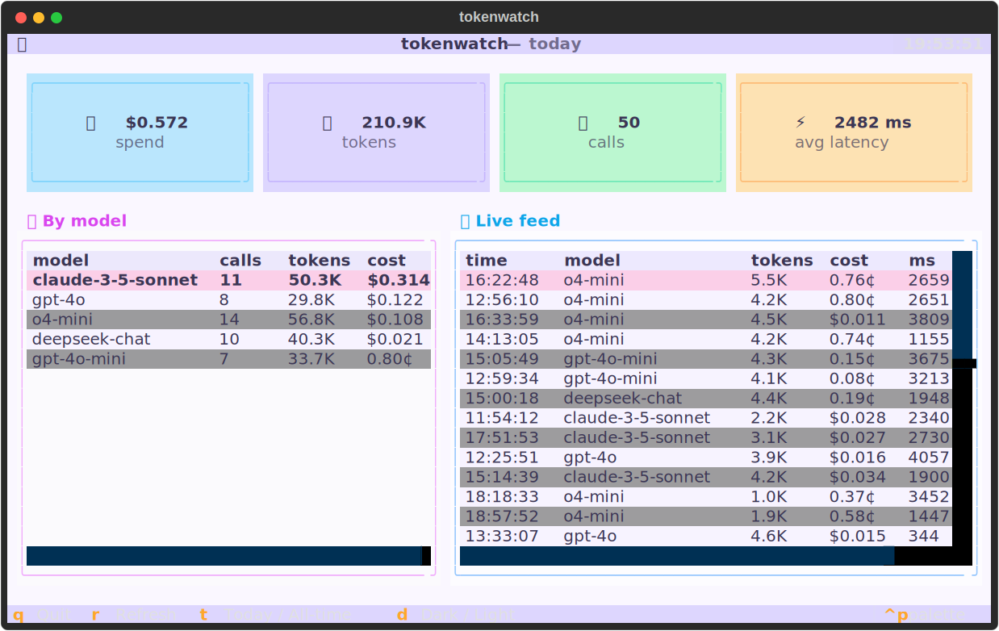
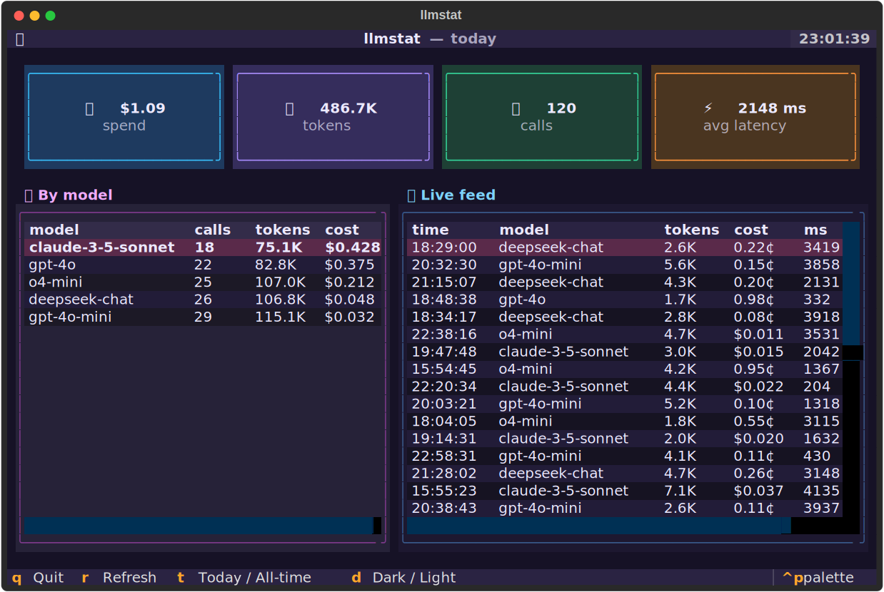

<div align="center">

# 👁️ tokenwatch

### See what your LLM calls *actually* cost — in real time.

A modern, playful terminal dashboard that sits in front of **any OpenAI-compatible API**
(OpenAI, DeepSeek, OpenRouter, LiteLLM, vLLM, Ollama, your own gateway…) and shows you
live token usage, cost, and latency. No SDK changes. No cloud. No account.

`pip install tokenwatch` → point your base URL at it → watch the numbers move.

<table>
<tr>
<td align="center"><b>Light</b><br></td>
<td align="center"><b>Dark</b><br></td>
</tr>
</table>

<sub>Two pastel themes — toggle with <code>d</code>. Today / all-time with <code>t</code>.</sub>

</div>

---

## Why

You're shipping with LLMs and you have no idea what you're spending until the invoice lands.
The big observability platforms are heavy, hosted, and want your data. **tokenwatch** is the
opposite: one tiny local proxy, one SQLite file, one good-looking TUI.

- 🪶 **Zero code changes** — it's a drop-in proxy. Change one base URL.
- 🔌 **Provider-agnostic** — anything that speaks the OpenAI API works.
- 🌊 **Streaming-aware** — reads usage from SSE chunks, not just plain responses.
- 💸 **Cost, not just tokens** — built-in pricing table, override your own rates.
- 🔒 **Local-first** — your prompts never touch our anything. There is no "our anything".

## Install

```bash
pip install tokenwatch
```

## 60-second tour (no API key needed)

```bash
tokenwatch demo      # seed some realistic sample traffic
tokenwatch dash      # open the dashboard
```

Press `t` to flip between **today** and **all-time**, `r` to refresh, `q` to quit.

## Real usage

**1. Start the proxy** in front of your provider:

```bash
tokenwatch serve --upstream https://api.openai.com
# tokenwatch proxy -> https://api.openai.com
# point your client base_url at: http://127.0.0.1:8787/v1
```

**2. Point your client at it** — only the base URL changes:

```python
from openai import OpenAI

client = OpenAI(base_url="http://127.0.0.1:8787/v1")  # was: the real URL
client.chat.completions.create(
    model="gpt-4o-mini",
    messages=[{"role": "user", "content": "hi"}],
)
```

**3. Watch it live** in another terminal:

```bash
tokenwatch dash
```

That's it. Every call your app makes now shows up with tokens, cost, and latency.

### Tag your traffic (optional)

Send an `X-Tokenwatch-Project` header and tokenwatch will group spend by project —
handy when one machine drives several apps.

### Fix or add pricing

Models change prices constantly. Drop a `~/.tokenwatch/pricing.json` to override:

```json
{ "my-self-hosted-llama": [0.0, 0.0], "gpt-4o": [2.50, 10.00] }
```

Values are USD per **1M** tokens: `[input, output]`.

## How it works

```
your app ──▶ tokenwatch proxy ──▶ real LLM API
                  │
                  └─▶ SQLite (~/.tokenwatch/usage.db) ──▶ TUI dashboard
```

The proxy forwards requests untouched and reads the standard `usage` block out of the
response (for streams, it tees the SSE and grabs the final usage chunk). Nothing is
buffered to disk except the counts you see.

## Roadmap

- [ ] Budgets & alerts (warn at $X/day)
- [ ] Export to CSV / Prometheus
- [ ] Per-project & per-key breakdown views
- [ ] `tokenwatch top` — a one-line live status bar

Ideas and PRs welcome — see an issue you'd like? Open one.

## License

MIT © tokenwatch contributors
